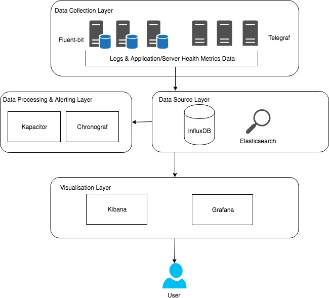
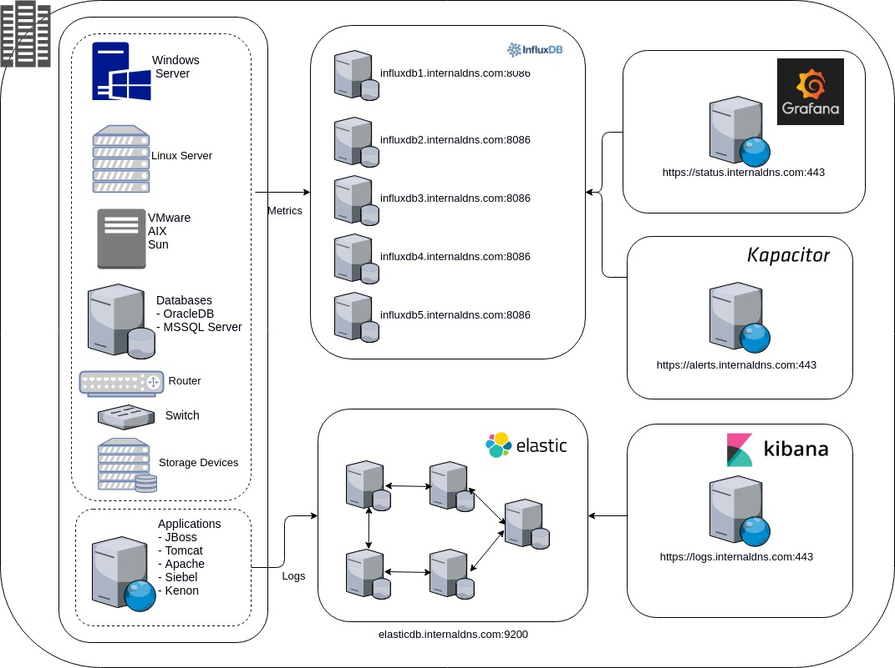

**A unified application infrastructure monitoring and log analytics solution**

## Contents:

### 1.   Introduction & Getting Started
HAWK is basically an end to end infrastucture and logs analytics monitoring solution which is a robust combination of the most popular, widely used open-source monitoring tools in market. HAWK is comprised of:
 - **InfluxDB** - The datastore of all the timeseries data collected via various types of agents.
 - **Elasticsearch** - The datastore of all the logs and APM data collected via agents.
 - **Kibana** - For visualization of elastisearch data viz. Logs and APM Data
 - **Grafana** - For visualization of all the monitoring data by the means of dashboard
 - **Kapacitor*** - For automated alerts automation
 - **Promethous*** - An open-source monitoring system with a dimensional data model, flexible query language, efficient time series database and modern alerting approach

Note: * represents optional components.

### 2.   Installation & Setup of HAWK
HAWK Monitoring solution can be setup on any cloud platform. HAWK installation and setup is quite easy and simple. Below is the HAWK Architecture with a digramatic approch.

**Diagram 1**

**Diagram 2**

### 3.   HAWK Server Setup
- [InfluxDB Setup](documentation/influx.md) 
- [Elasticsearch & Kibana Setup](documentation/elasticsearch.md) 
- [Grafana Setup](documentation/grafana.md)
- Kapacitor Setup
- Promethous Setup

### 4.   HAWK Client Setup
- [Telegraf Agent Setup](documentation/telegraf.md) 
- [Fluent-bit Setup](documentation/fluent-bit.md)
- Prometheus Agent Setup

### 5.   Alerting Setup
- Alerts via Grafana
- Alerts via Kapacitor

#### 6.  Basic Configurations
- [Telegraf](configurations/telegraf.conf)
- [Fluent-bit](configurations/fluent-bit.conf)
- InfluxDB
- Prometheous
- Grafana
- Kibana
- Elasticsearch

#### 7.  Predefined Grafana Dashboards
- VM/Host Dashboard
- Docker Dashboard
- Pingdom Dashboard
- Application Dashboard
    - Java Application
    - PHP Application
    - Node Application

- Database Dashboard
    - [MongoDB](dashboards/mongodb.json)
    - [MySQL](dashboards/mysql.json)
    - [Elasticsearch](dashboards/elasticsearch.json)
    - [InfluxDB](dashboards/influx.json)
    - [Java Microservice](dashboards/java_application.json)
    - [ECS Cluster](dashboards/ecs.json)
    - [hazelcast](dashboards/hazelcast.json)
    - [rabbit](dashboards/rabbit.json)
    - [google analytics](dashboards/google_analytics.json)
    - [hockey](dashboards/hockey.json)
    - [home dashboard](dashboards/home.json)
    - [pingdom](dashboards/pingdom.json)
    - [docker](dashboards/docker.json)
    - [vm_hosts](dashboards/vm.json)

#### 8.   Naming Conventions

#### 9.   Ansible Guide
# FAQ